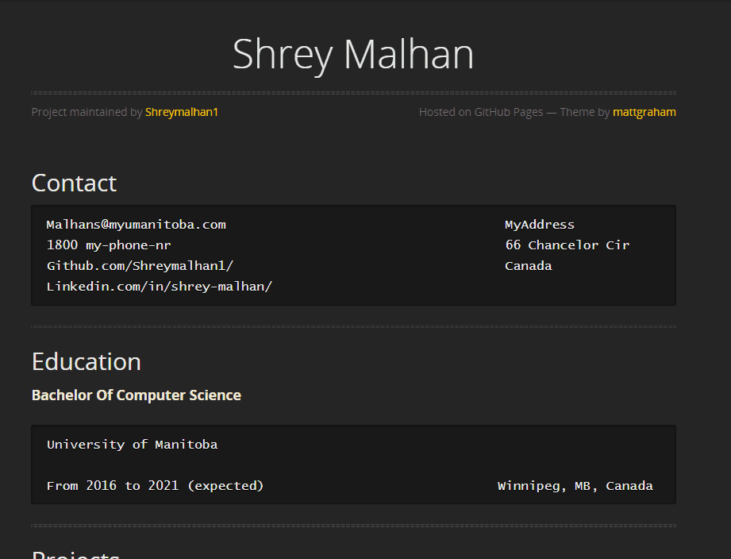
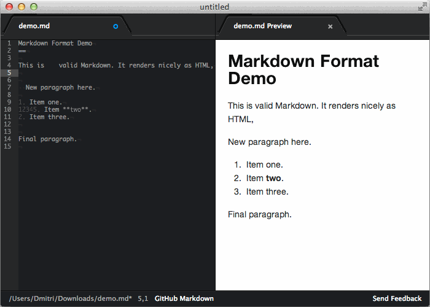
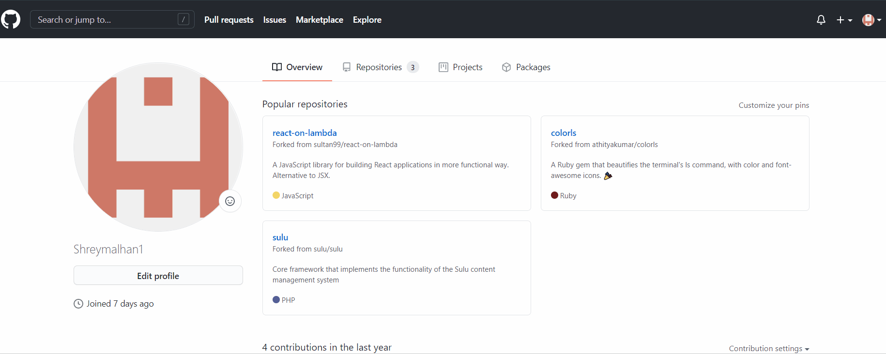
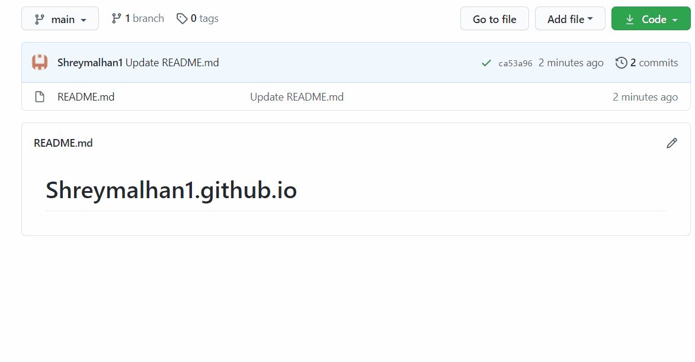
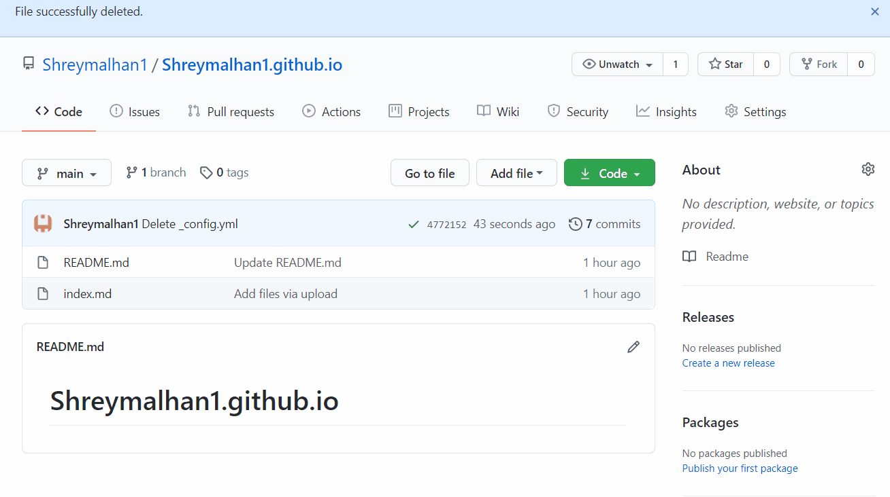

# Learn how to host a Resume on GitHub Pages

## Table of Contents
* [Introduction](#introduction)
* [GitHub](#what-is-github) 
* [MarkDown](#what-is-markdown)
* [Prerequisites](#prerequisites)
* [Hosting Resume](#lets-get-started)
* [More Resources](#more-resources) 
* [Authors and Acknowledgement](#authors-and-acknowledgment)
* [FAQ's](#faqs)
## Introduction
This README provides a detailed step-by-step description on how to host resumes on GitHub using concepts from **Etter's Book  Modern Technical Writing.**

   
## What is GitHub?

[Github](https://www.youtube.com/watch?v=w3jLJU7DT5E&ab_channel=GitHub) is a code sharing and publishing platform which can connect people and facilitate them to work on a problem together from anywhere in the world. Github uses a feature called **Version Control** which keeps track of all the changes you or the other developers make on the project.

The three features of GitHub `fork, pull request and merge` are what make GitHub so powerful. *Fork* is coping a repository from one user's account to another. Then you can modify that repository under your own account. If you would like to share your changes, you can create a *pull request* for the original owner of the repo. That user can then *merge* the changes found in your repo with the original repo. 
 

## What is MarkDown?

 [Markdown](https://www.youtube.com/watch?v=f49LJV1i-_w&ab_channel=Codecademy) is a lightweight markup language to add formating elements to plain text and making writing for the internet easier. It has been widely adopted by the developers because it does not take long to learn the [Markdown syntax](https://www.markdowntutorial.com/) and can be used for everything. 
Infact, I used MarkDown to create this README file and the resume which I am hosting in this repository.

 

### Prerequisites

For this tutorial, you will need two things:

**1. A GitHub Account**

Signing up for a [GitHub account](https://github.com/) could not have been any simpler. You just need to create a username, followed by an email address and a password and you are all set to explore the GitHub world.

**2. A Resume**

Your resume can be of any format, i.e. .txt, .md etc. In this tutorial, we will be hosting Markdown created resumes.

 

### Lets Get Started

Once you are all set with the above mentioned prerequisites, following steps should be pursued. 

#### 1. Creating a Repository
A repository, also known as *Repo*, is a folder where all your project files are stored.

* In the upper-right corner of any page, click the `+` button and select `New repository`.
* Using the `Owner` button you can select which accout should own the repository
* Give your repository a suitale name and an optional description. If you are planning to publish the site, then repository name **must** end with `.github.io`.
* You can choose to make the repository private or public.
* Select `Add a README file` under *Initialize this repository with:* This option will create a README file for you and makes it easier to implement it.
* Click Create repository.
 

#### 2. Add a file to the Repository
You can add more pages to your site by creating new files.
* Click on the `Add file` drop-down button.
* Select the option based on your convinience. 
* If you are choosing `Create a file`, give the file a name and an extension like .txt or .md
* Click `Commit new file`.

 

#### 3. Adding theme to the file
You can add a theme to your GitHub Pages site to customize your site’s look and feel.This can be done by adding a [Jekyll](https://docs.github.com/en/free-pro-team@latest/github/working-with-github-pages/about-github-pages-and-jekyll) theme to your repository.  

* Under your repository name, click `Settings`.
* Under GitHub Pages, click `Choose a theme`.
* Choose the theme you like and then click `Select theme`.

A new file, `_config.yml` should be created in your repo which store all the Jekyll commands. 

   

 

### More Resources
* GitHub Resources
    * [What is GitHub?](https://www.youtube.com/watch?v=w3jLJU7DT5E&ab_channel=GitHub)
    * [GitHub for beginners](https://readwrite.com/2013/09/30/understanding-github-a-journey-for-beginners-part-1/).
* Markdown Resources
    * [What is MarkDown?](https://www.youtube.com/watch?v=f49LJV1i-_w&ab_channel=Codecademy)
    * [Markdown Tutorial](https://www.markdowntutorial.com/).
    * More about [GitHub Flavored Markdown](https://github.github.com/gfm/).
* Jekyll Resources
    * [What is Jekyll?](https://www.youtube.com/watch?v=T1itpPvFWHI&list=PLLAZ4kZ9dFpOPV5C5Ay0pHaa0RJFhcmcB&ab_channel=MikeDane)
    * [Jekyll Tutorial](https://www.youtube.com/playlist?list=PLLAZ4kZ9dFpOPV5C5Ay0pHaa0RJFhcmcB)
* A link to [Andrew Etter's book](https://www.amazon.ca/Modern-Technical-Writing-Introduction-Documentation-ebook/dp/B01A2QL9SS).

 

### Authors and Acknowledgment
* Shrey Malhan
* Nicole Ciceron
* Mohammad Inan

 

### FAQ's
**Why is markdown better than a word processor?**
> Microsoft Word is a complicated program which gets messy really quickly.   
> Markdown is a lightweight markup language with features like **version control** which helps you track all the changes made to the project my different group members, whereas, in word documents it is imposible to merge different versions together or keep a track of changes. 

**How can I change the description of my repository?**

> * On the right side of the screen, there will be an **about** section which display the description of the repository. 

> * By clicking `⚙️` present on the right side of the section, you can change the desription.

---

